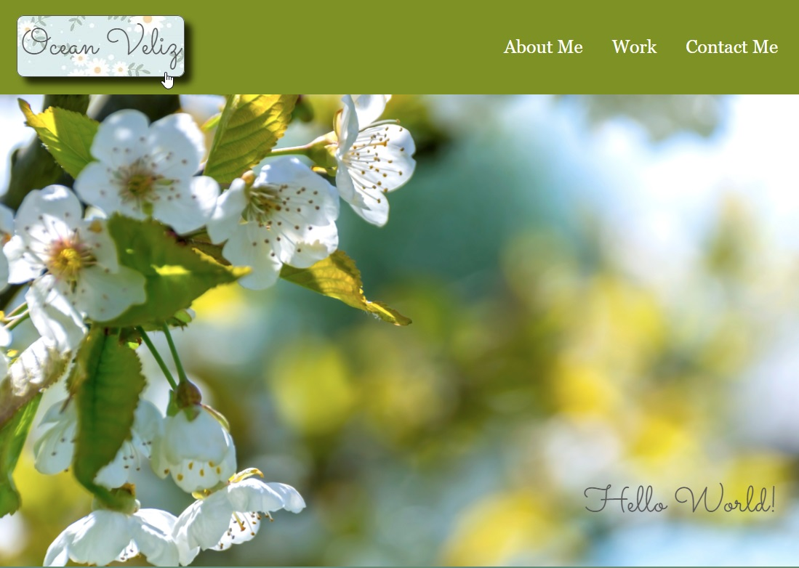

# My Portfolio

## Purpose
This website is to showcase my skills so far using html and advanced CSS to potential employers. I am in my second week of the UW-Madison's Coding Bootcamp and was able to build this with the skills I have learned so far.

## Built With
* HTML
* CSS

## Website
https://oceanlatte.github.io/my-portfolio/

## Features
One of my favorite features of this site is the hover pseudo class used on the links in the header and footer!

